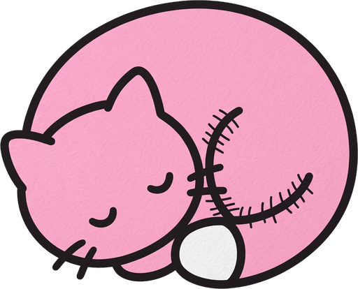
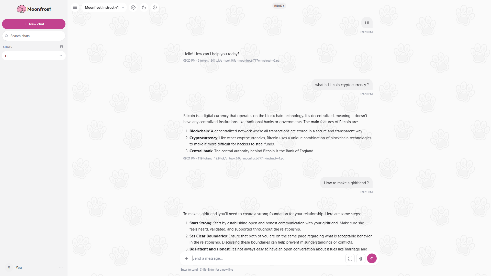
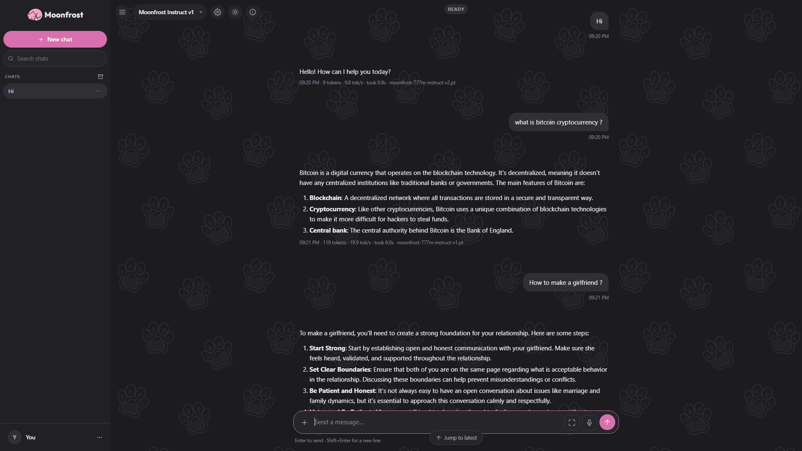
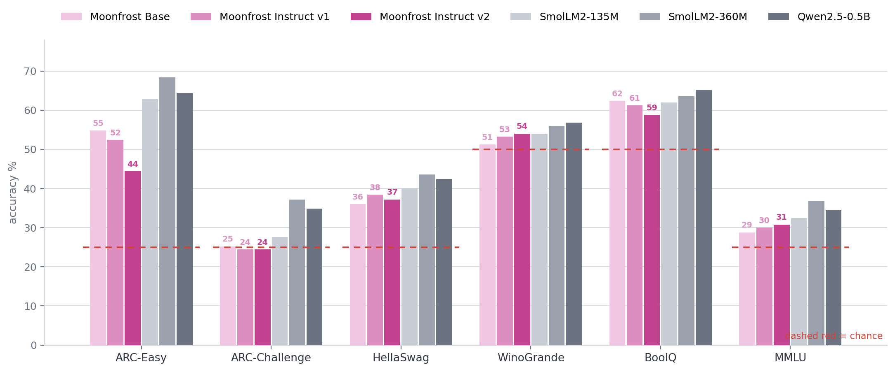
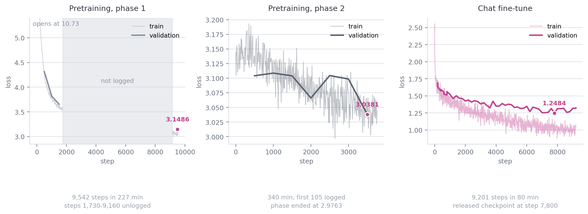

<p align="center">
  
</p>

<h1 align="center">Moonfrost AI</h1>

<p align="center">
  A 777M-parameter Mixture-of-Experts language model trained from scratch.
</p>

<p align="center">
  <a href="https://huggingface.co/whoashish115/Moonfrost-777M-Instruct-v2">Model</a> &middot;
  <a href="https://huggingface.co/whoashish115/Moonfrost-777M">Base</a> &middot;
  <a href="https://huggingface.co/datasets/whoashish115/Moonfrost-Persona-SFT">Dataset</a> &middot;
  <a href="https://moonfrost-ai.vercel.app">Site</a> &middot;
  <a href="docs/architecture.md">Architecture</a> &middot;
  <a href="docs/pipeline.md">Pipeline</a> &middot;
  <a href="docs/benchmarks.md">Benchmarks</a> &middot;
  <a href="https://wandb.ai/whoashish115-base/moonfrost-777m">Training runs</a>
</p>

---

Moonfrost is a decoder-only language model of 777,148,032 parameters, of which 161,036,224
are active for any given token. It follows DeepSeek-V2: Multi-head Latent Attention over a
compressed key-value cache, and DeepSeekMoE feed-forward layers where a router selects 3 of
32 experts per layer alongside one shared expert.

It was pretrained on approximately 6 billion tokens of FineWeb-Edu across two phases, then
fine-tuned for chat on 2.7 billion tokens of instruction data. Training took about 12
H100-hours at a total cost of roughly $55.

This repository contains the complete pipeline: tokenizer training, the model definition,
pretraining and supervised fine-tuning loops, the evaluation harness, the cloud orchestration
with its budget guards, and a local chat server. The architecture is implemented from the
published papers rather than adapted from released code.

| Property | Value |
|---|---|
| Parameters | 777,148,032 total, 161,036,224 active per token |
| Pretraining | ~6B tokens, validation loss 2.976 |
| Fine-tuning | 2.7B tokens over 1.7 epochs, validation loss 1.2484 |
| Held-out perplexity | 51.64 |
| Training throughput | 179,000 tokens/second, 1x H100 |
| Inference | 16.8 tokens/second, fp32, batch 1, RTX 3050 |

<p align="center">
  
  <br><br>
  
</p>

## Run

```bash
git clone https://github.com/whoashish115/moonfrost-ai
cd moonfrost
pip install -r requirements.txt
python training/server.py
```

The server selects the checkpoint with the lowest validation loss and opens a chat interface
at `http://localhost:8000`. Weights are pulled from
[Hugging Face](https://huggingface.co/whoashish115/Moonfrost-777M-Instruct-v2) or read from
a local `checkpoints/` directory. Inference runs locally: no account, no API key, no
telemetry. Conversation history is stored in a SQLite file under `training/db/`.

## Interface

The chat interface is a single HTML file served by FastAPI, with replies streamed over
server-sent events. No build step and no framework.

| Area | What is there |
|---|---|
| **Conversations** | Streaming replies, stop mid-generation, edit and regenerate, per-message token count, tokens/second, elapsed time and the checkpoint that produced it |
| **Organising** | Pinned chats in their own section, archive, full-text search, rename, workspaces, export to JSON, and a queue so several messages can be sent before the first reply lands |
| **Code** | Syntax highlighting for Java, Python, JavaScript, TypeScript, C-family, SQL and shell, with copy buttons. Unfenced code is detected by shape, because the model rarely writes fences |
| **Appearance** | 15 theme presets, independent light and dark palettes, three contrast levels, and every colour individually overridable |
| **Prompts** | 148 prompts auditioned against this model and kept only if the answer completed and held together, shown as chips above the composer |
| **About page** | An interactive chart placing this model against 28 others from GPT-2 to o1, on capability, scale or token efficiency, built from `docs/eval.json` so it cannot drift from what was measured |
| **Input** | File attachments for text formats, dictation through the Web Speech API, a composer that expands for long messages, and full keyboard control |
| **Checkpoints** | Switch between base and instruct models at runtime, with a warning when a base checkpoint is loaded, since a base model answers every question with fluent nonsense |

## Benchmarks

Five-shot, 250 examples per benchmark, scored by the log-probability of each answer
continuation. Reference models were run through the same harness on the same examples
rather than quoted from their model cards, since prompt wording and length normalisation
shift these scores by several points: Qwen2.5-0.5B publishes 47.5 on MMLU and scores 34.4
here. Both Moonfrost checkpoints are listed, because the instruction tune does not leave
these numbers where pretraining left them.

| Benchmark | Chance | Moonfrost Base | Moonfrost Instruct v1 | Moonfrost Instruct v2 | SmolLM2-135M | SmolLM2-360M | Qwen2.5-0.5B |
|---|---|---|---|---|---|---|---|
| ARC-Easy | 25.0 | 54.8 | 52.4 | 44.4 | 62.8 | **68.4** | 64.4 |
| ARC-Challenge | 25.0 | 25.2 | 24.4 | 24.4 | 27.6 | **37.2** | 34.8 |
| HellaSwag | 25.0 | 36.0 | 38.4 | 37.2 | 40.0 | **43.6** | 42.4 |
| WinoGrande | 50.0 | 51.2 | 53.2 | 54.0 | 54.0 | 56.0 | **56.8** |
| BoolQ | 50.0 | 62.4 | 61.2 | 58.8 | 62.0 | 63.6 | **65.2** |
| MMLU | 25.0 | 28.8 | 30.0 | 30.8 | 32.4 | **36.8** | 34.4 |



The model ranks last or near-last on most tasks. Six billion tokens for 777 million
parameters is roughly eight tokens per parameter, against a compute-optimal ratio near
twenty and against reference models trained on two to eighteen trillion tokens at half the
size. The training budget produced conversational behaviour rather than knowledge.

Read the three Moonfrost columns down each row. Almost every difference between them is
noise: at 250 examples the 95% interval on a single score is roughly **±6 points**, and
fifteen of the eighteen gaps are under three. One benchmark moves, and it moves in one
direction. **ARC-Easy falls 54.8, 52.4, 44.4** across the base, the half-epoch tune and the
1.7-epoch tune. Ten points is what it costs to teach the model to answer in a chat format
instead of continuing a multiple-choice stem, and the cost grows with how long you tune.

The harness draws its five in-context examples from the rows just past the evaluation
slice, so the sample size also fixes the prompt. An earlier run of the instruct weights
over 200 examples scored 44.5 on BoolQ and the run over 250 scored 58.8, on the same
weights and the same harness. That is the reason every model here was scored rather than
quoted.

## Training

| Stage | Data | Steps | Tokens | Result |
|---|---|---|---|---|
| Pretrain phase 1 | FineWeb-Edu shards 0-2 | 9,542 | ~2.8B | val loss **3.1486** at step 9,500 |
| Pretrain phase 2 | FineWeb-Edu shards 3-7 | ~12,200 | ~3.1B | val loss **2.976** at step 11,000 |
| Chat fine-tune | smol-smoltalk, smoltalk, persona set | 9,201 | 2.7B | val loss **1.2484** at step 7,800 |

The phases read disjoint shards, so no document was seen twice. They also ran on separate
machines, which works because the learning rate is parameterised by **elapsed fraction of
training rather than by step**: phase 2 resumed at fraction 0.5227 and the cosine curve
continued rather than restarting. Only the weights crossed the boundary, which is why phase
2 re-warms for 150 steps.



Those panels show what was logged, which is less than what was run. Phase 1 was attempted
twice: the first try died at step 1,730 when its client connection dropped, and that failed
attempt is what `docs/logs/base1_train_log.jsonl` contains. The successful run's log was on
a Modal volume that got deleted with the account. `training/recover_logs.py` pulled back
what Modal still retained of each stopped app, which is where phase 1's numbers above come
from; those fragments are in `docs/logs/recovered/`. The middle of both pretraining runs is
gone, and the charts say so on their face.

Loss, learning rate, gradient norm and throughput for all three runs are on
[Weights & Biases](https://wandb.ai/whoashish115-base/moonfrost-777m), replayed step by step from
the JSON Lines logs in `docs/logs/`. There was no W&B client attached during training, so
`training/export_to_wandb.py` reconstructs the runs afterwards; it also writes plain CSV
for anything that would rather read that.

## Layout

```
moonfrost/
├── training/
│   ├── model.py              MLA attention and the MoE layer, 908 lines
│   ├── config.py             every structural number, and the parameter counters
│   ├── train.py              pretraining loop
│   ├── sft_train.py          chat fine-tuning
│   ├── sft_data.py           conversations into packed rows, and those rows on disk
│   ├── persona_data.py       generates the identity set
│   ├── chat_format.py        the wire format and the streaming decoder
│   ├── evaluate_model.py     benchmarks, perplexity, generation speed
│   ├── make_charts.py        the charts, drawn from the measured results
│   ├── cloud_run.py          the cloud training pipeline, with cost guards
│   ├── deploy_demo.py        serves the model on Modal with scale-to-zero
│   ├── recover_logs.py       rebuilds lost logs from retained console output
│   ├── server.py             FastAPI chat server
│   ├── static/
│   │   ├── index.html        the markup, and nothing else
│   │   ├── css/              one stylesheet per region of the interface
│   │   ├── js/               one script per concern, loaded in declaration order
│   │   ├── cats/             the mark and the tiled background
│   │   └── icons/            favicons and the web manifest
│   └── tests/                102 checks over the model, data path and training plan
├── docs/
│   ├── architecture.md       what the model is
│   ├── pipeline.md           what every script does, in execution order
│   ├── benchmarks.md         how it was measured and what the numbers mean
│   ├── training.md           the runs, the hyperparameters, and what went wrong
│   ├── eval*.json            measured results, read directly by the About page
│   ├── charts/               benchmark, scale and loss charts
│   ├── logs/                 raw training logs, including recovered fragments
│   └── wandb/                the same logs as CSV
├── tokenizer/                the trained byte-level BPE vocabulary
├── checkpoints/              .pt files, not in git
├── requirements.txt
└── README.md
```

## Reproduce

```bash
python training/tests/verify_all.py         # 52 checks on the model and data path
python training/tests/verify_cloud_run.py   # 17 checks on the training plan and budget
python training/evaluate_model.py           # benchmarks, perplexity, speed
python training/make_charts.py              # redraw the charts from those results
```

The cloud pipeline is one command per stage and **refuses to import** if any account's
worst case exceeds its cap:

```bash
modal run training/cloud_run.py --stage account1 --spawn
```

Seeds are fixed throughout: 1337 for data shuffles, 5 and 11 for sampling probes.

## Limits

The model fabricates facts confidently, particularly on topics sparse in educational web
text. It performs no arithmetic or multi-step reasoning, has no tool use, no retrieval and
no memory across conversations. English only, with a 1,024-token context. Open-ended
procedural questions tend to run to the token limit without concluding, while short
definitional questions terminate cleanly.

There is no safety tuning, no RLHF and no content filtering at either the data or the output
stage. This is a demonstration of a complete training pipeline at small scale, not a
deployable assistant.

## References

Written from scratch against these papers rather than adapted from released code.

| Paper | What it contributes |
|---|---|
| [DeepSeek-V2](https://arxiv.org/abs/2405.04434) | Multi-head Latent Attention, DeepSeekMoE |
| [DeepSeek-V3](https://arxiv.org/abs/2412.19437) | routing and load-balancing refinements |
| [Attention Is All You Need](https://arxiv.org/abs/1706.03762) | the transformer |
| [RoFormer](https://arxiv.org/abs/2104.09864) | rotary position embeddings |
| [GLU Variants](https://arxiv.org/abs/2002.05202) | SwiGLU |
| [RMSNorm](https://arxiv.org/abs/1910.07467) | normalisation without mean subtraction |
| [GShard](https://arxiv.org/abs/2006.16668) | capacity-based expert dispatch |
| [Switch Transformer](https://arxiv.org/abs/2101.03961) | the load-balancing auxiliary loss |
| [Chinchilla](https://arxiv.org/abs/2203.15556) | the twenty-tokens-per-parameter ratio |
| [FlashAttention](https://arxiv.org/abs/2205.14135) | the fused kernel used through SDPA |
| [BPE for NMT](https://arxiv.org/abs/1508.07909) | byte-pair encoding |

Data and tooling: [FineWeb-Edu](https://huggingface.co/datasets/HuggingFaceFW/fineweb-edu)
for pretraining, [smol-smoltalk](https://huggingface.co/datasets/HuggingFaceTB/smol-smoltalk)
and [smoltalk](https://huggingface.co/datasets/HuggingFaceTB/smoltalk) for chat,
[SmolLM2](https://huggingface.co/HuggingFaceTB/SmolLM2-360M) and
[Qwen2.5](https://huggingface.co/Qwen/Qwen2.5-0.5B) as benchmark references, and PyTorch,
Hugging Face `tokenizers` and `transformers`, FastAPI and Modal.

## License

Apache 2.0, Copyright 2026 Ashish Kumar. The full text is in [LICENSE](LICENSE).
